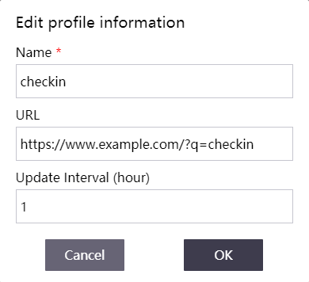
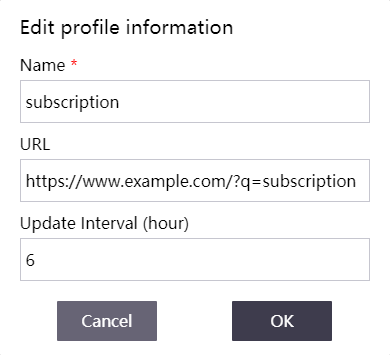

# CFW Scripts

[/badge.svg>)](https://github.com/yi-Xu-0100/hub-mirror)
[](https://github.com/yi-Xu-0100/cfw-scripts)
[](https://github.com/yi-Xu-0100/cfw-scripts/releases)
[](./LICENSE)

[](https://github.com/yi-Xu-0100/traffic2badge/tree/traffic#-cfw-scripts)
[](https://github.com/yi-Xu-0100/traffic2badge/tree/traffic#-cfw-scripts)
[](https://github.com/yi-Xu-0100/traffic2badge/tree/traffic#-cfw-scripts)
[](https://github.com/yi-Xu-0100/traffic2badge/tree/traffic#-cfw-scripts)

Some scripts for [parser](https://docs.cfw.lbyczf.com/contents/parser.html) in [Fndroid/clash_for_windows_pkg](https://github.com/Fndroid/clash_for_windows_pkg).

**Only for studying and testing usage, and delete code yourself with the usage completed. Thanks!** 😜

## 🎨 Table of Contents

- [🎨 Table of Contents](#-table-of-contents)
- [🚀 Usage](#-usage)
  - [setup repository with git and npm](#setup-repository-with-git-and-npm)
  - [Setup parser for `auto-check-in.js`](#setup-parser-for-auto-check-injs)
  - [Setup parser for `subs-info-parser.js`](#setup-parser-for-subs-info-parserjs)
- [📝 Scripts](#-scripts)
- [🍱 Libraries](#-libraries)
- [🔊 CHANGELOG](#-changelog)
- [📄 LICENSE](#-license)
- [🎉 Thanks](#-thanks)

## 🚀 Usage

### setup repository with git and npm

The scripts used [mikaelbr/node-notifier](https://github.com/mikaelbr/node-notifier) for fitting windows notification persist in action center.

```bash
git clone https://github.com/yi-Xu-0100/cfw-scripts.git
npm ci
npm run start
```

The notify will be test and copy `./variables.json` to `./scripts/variables.json`. **You can set variables in `./scripts/variables.json`, and the file will include in `.gitignore`.**

### Setup parser for `auto-check-in.js`

Set the example subscription link for using the `auto-check-in.js`, and set the update interval in 1 hour(optional).



You can set the parsers with `reg` to fit the example link.

```yaml
parsers:
  - reg: .*example.*q=checkin$
    file: 'D:/Applications/cfw-scripts/scripts/auto-check-in.js' #set the path of `auto-check-in.js`.
```

### Setup parser for `subs-info-parser.js`

Set the example subscription link for using the `subs-info-parser.js`, and set the update interval in 1 hour(optional).



You can set the parsers with `reg` to fit the example link.

```yaml
parsers:
  - reg: .*example.*q=subscription$
    file: 'D:/Applications/cfw-scripts/scripts/auto-check-in.js' #set the path of `subs-info-parser.js`.
```

## 📝 Scripts

|                         name                         |         description          |    variables     |
| :--------------------------------------------------: | :--------------------------: | :--------------: |
| [subs-info-parser.js](./scripts/subs-info-parser.js) | get subscription information | subs-info-parser |
|    [auto-check-in.js](./scripts/auto-check-in.js)    |        auto check in         |  auto-check-in   |
|     [change-rules.js](./scripts/change-rules.js)     |      add personal rule       |                  |
|      [change-keys.js](./scripts/change-keys.js)      |     fit new version key      |                  |

## 🍱 Libraries

|                  name                  |    description     |       dependencies       |
| :------------------------------------: | :----------------: | :----------------------: |
| [notify.js](./lib/subs-info-parser.js) | notify for windows | [mikaelbr/node-notifier] |

[mikaelbr/node-notifier]: https://github.com/mikaelbr/node-notifier

## 🔊 CHANGELOG

- [CHANGELOG](https://github.com/yi-Xu-0100/cfw-scripts/blob/main/CHANGELOG.md)

## 📄 LICENSE

- [MIT](https://github.com/yi-Xu-0100/cfw-scripts/blob/main/LICENSE)

## 🎉 Thanks

- [Fndroid/clash_for_windows_pkg](https://github.com/Fndroid/clash_for_windows_pkg)
